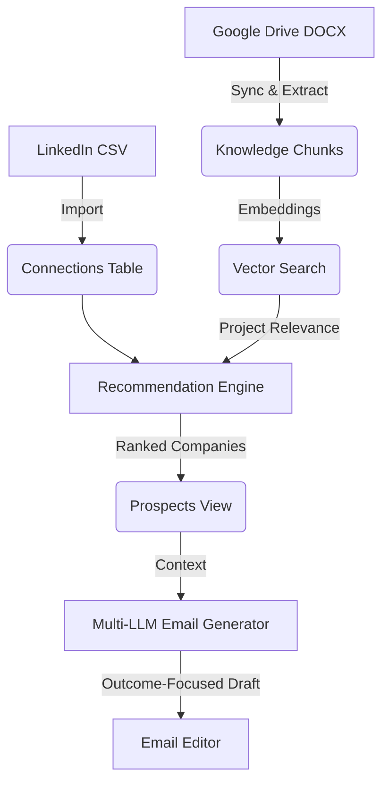

# WhileOne Outreach Assistant

## Project Overview
The WhileOne Outreach Assistant is a highly intelligent, AI-powered internal tool designed to automate and optimize the process of discovering and reaching out to potential client prospects.

The system ingests the user's professional network (via LinkedIn CSV exports), deeply analyzes the target companies against WhileOne's proprietary knowledge base of past projects (synced from Google Drive DOCX files), and surfaces the most relevant companies. It then uses state-of-the-art LLMs to draft hyper-personalized outreach emails focusing on business outcomes and project relevance.

## Core Features
- **LinkedIn CSV Import:** Seamlessly ingest and parse first-degree connections.
- **Duplicate Contact Handling:** Intelligently merge and manage duplicate entries.
- **Company Search & Fuzzy Matching:** Robust resolution of company names (e.g., resolving typos like "Nvidea" to "NVIDIA").
- **Google Drive Sync:** Automated fetching of past project documentation (DOCX format) directly from Google Drive.
- **Knowledge Base Indexing & Vector Search:** Chunks and generates embeddings for past projects, allowing semantic similarity searches.
- **Project Relevance Scoring:** Evaluates how well a prospect company aligns with WhileOne's historical project expertise.
- **Seniority Ranking:** Ranks target contacts within a company based on their role and seniority.
- **Recommendation Engine (with Caching):** Aggregates connection strength, seniority, and project relevance into a unified score. Results are progressively streamed (SSE) and persistently cached to avoid rate limits.
- **Multi-Provider LLM Support:** Leverages Gemini, Claude, OpenAI, and Grok for content generation with built-in fallbacks.
- **Email Generation & Refinement:** Generates outcome-focused outreach drafts using specialized relationship skills (e.g., "Cold Outreach", "Warm Introduction") and allows interactive refinement.

## Architecture Flow



## Database Schema

The application runs on Supabase (PostgreSQL). The core active tables are:

- **`profiles`**: Stores user authentication and profile data.
- **`connections`**: Stores raw imported LinkedIn connections. Includes a unique constraint to prevent duplicate profile URLs.
- **`knowledge_documents`**: Tracks metadata for DOCX files synced from Google Drive.
- **`knowledge_chunks`**: Stores text chunks and their pgvector embeddings derived from `knowledge_documents`. Used for semantic search.
- **`company_industry_cache`**: Caches basic metadata (industry, size, etc.) about companies to prevent repeated lookups.
- **`company_score_cache`**: Persistently stores the highly-computed recommendation breakdown (project relevance, connection strength, seniority) to provide fast, resilient load times.
- **`prospects`**: Tracks manually saved or evaluated prospects.
- **`generated_emails`**: Stores generated drafts and tracks refinement history for analytics.
- **`sync_logs`**: Audit trail for Google Drive synchronization runs.

## LLM Providers
The application leverages an abstraction layer (`src/ai/models.ts`) to route generation tasks:
- **Gemini (Google):** Default provider (`gemini-2.5-pro` for reasoning, `gemini-2.5-flash` for fast tasks).
- **Claude (Anthropic):** Supported via `claude-3-5-sonnet-20241022` and `claude-3-haiku-20240307`.
- **OpenAI:** Supported via `gpt-4o` and `gpt-4o-mini`.
- **Grok (xAI):** Supported via `grok-2-latest`.

## Environment Variables
Create a `.env.local` file with the following required variables:

```env
# Supabase Configuration
NEXT_PUBLIC_SUPABASE_URL="your_supabase_project_url"
NEXT_PUBLIC_SUPABASE_ANON_KEY="your_supabase_anon_key"

# LLM Provider API Keys
GOOGLE_GENAI_API_KEY="your_gemini_key"
ANTHROPIC_API_KEY="your_anthropic_key"
OPENAI_API_KEY="your_openai_key"
XAI_API_KEY="your_grok_key"

# Google Drive Integration
GOOGLE_DRIVE_FOLDER_ID="target_folder_id"
GOOGLE_SERVICE_ACCOUNT_EMAIL="service_account_email"
GOOGLE_PRIVATE_KEY="service_account_private_key"
```

## Setup & Local Development
1. Clone the repository.
2. Run `npm install` to install dependencies.
3. Configure your `.env.local` file.
4. Run Supabase migrations (`npm run supabase migration up` if applicable) to ensure the vector database and caching tables are initialized.
5. Run `npm run dev` to start the Next.js development server.
6. Navigate to `http://localhost:3000`.

## Current Limitations
- **Google Drive Rate Limits:** Very large DOCX syncs may encounter Google API rate limits. The sync log will note partial completions.
- **Vector Search Quotas:** The system relies on an external embedding provider. While results are progressively cached to mitigate this, generating recommendations for 1,000+ brand-new companies in a single pass may temporarily exhaust embedding quotas.
- **Incomplete Industry Data:** If a company lacks sufficient online presence, the industry resolution might fall back to "Unknown", which slightly weakens project matching accuracy.
